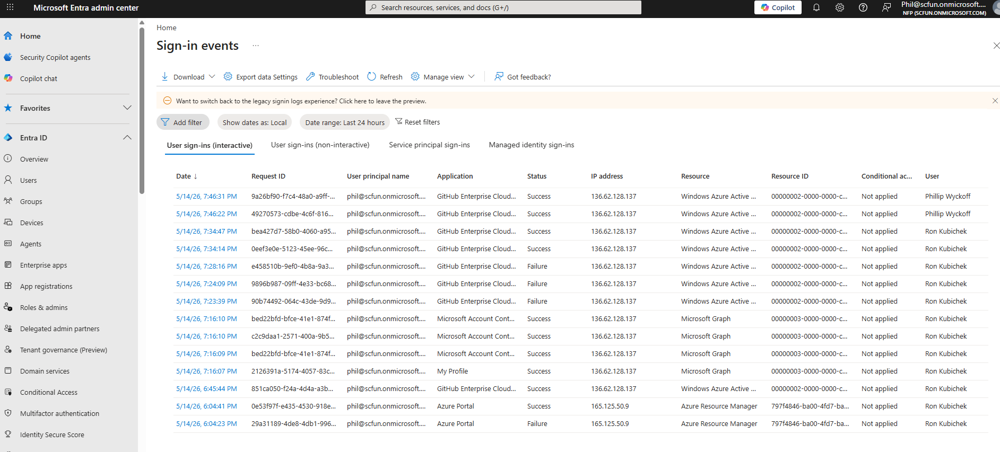
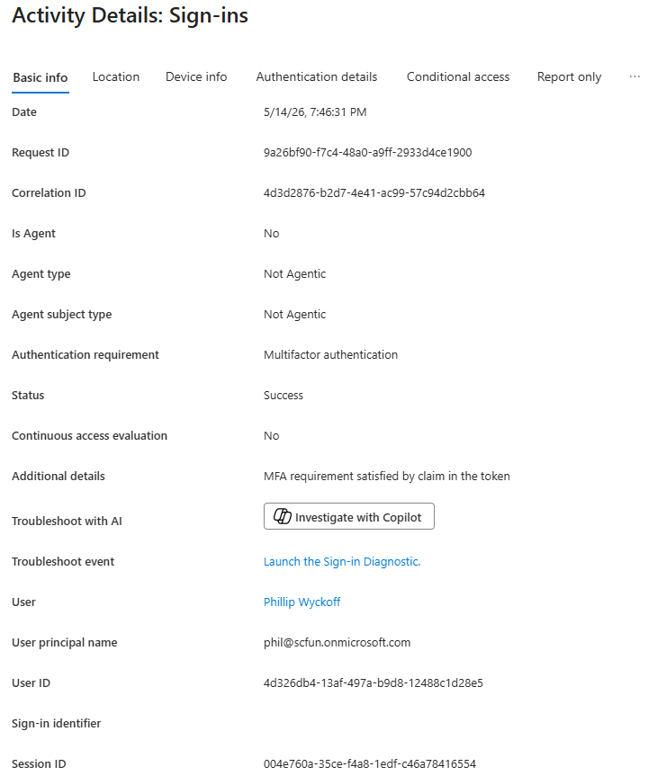

# Hybrid Identity & IAM Home Lab

This lab demonstrates an end-to-end IAM lifecycle from identity creation through authentication, access governance, and monitoring in a hybrid Microsoft environment.

## Overview
This project documents a hands-on IAM lab environment I built while transitioning from IT support into Identity and Access Management (IAM).

 ## Skills Demonstrated

- Active Directory Administration
- Microsoft Entra ID
- Microsoft Entra Connect
- PowerShell Automation
- Conditional Access
- Hybrid Identity Synchronization
- SAML 2.0 Federation
- Microsoft Graph API
- Terraform
- Identity Lifecycle Management (JML)
- RBAC
- MFA Enforcement

The lab environment includes:
- Windows Server 2022 Domain Controller
- On-premises Active Directory (`sc300lab.com`)
- Microsoft Entra ID tenant
- Microsoft Entra Connect synchronization

 

I used this environment to practice common IAM tasks such as user provisioning, group management, hybrid identity synchronization, MFA enforcement, and access governance.

---

# Phase 1: Identity Foundation (Active Directory Provisioning)

## Objective

This phase establishes the foundational identity structure in Active Directory and implements automated user provisioning using PowerShell.

The goal is to understand how identities are created, structured, and validated in an on-premises environment before being synchronized to Microsoft Entra ID in later phases.

---

## What I Implemented

### Identity Architecture
- Created Organizational Unit: `Sync_Users`
- Defined identity structure for lab users
- Configured User Principal Name (UPN) suffix for Entra ID compatibility
- Established consistent naming standards for user accounts

### Identity Provisioning
- Automated Active Directory user creation using PowerShell
- Generated multiple user personas:
  - Standard users
  - Admin account
  - Vendor account
  - Break-glass account
- Implemented duplicate account prevention logic
- Assigned UPN values aligned with hybrid identity requirements

### Identity Validation
- Verified user creation in Active Directory
- Confirmed correct OU placement
- Validated UPN formatting for cloud readiness
- Ensured multiple identity types were successfully created

---

## Why This Matters (IAM Context)

Active Directory is the source of identity in most enterprise IAM environments. Proper design and provisioning at this stage directly impacts all downstream identity, synchronization, and access control processes.

Key IAM principles demonstrated:

- OU structure defines synchronization scope to Microsoft Entra ID
- UPN format affects cloud identity matching and authentication
- Automation reduces manual provisioning errors and improves consistency
- Validation ensures identities are ready for hybrid synchronization

---

## Screenshots (Proof of Work)


---

## Implementation Details

<details>
<summary>View PowerShell Provisioning Script</summary>
  
```
<Import-Module ActiveDirectory

$TargetOU   = "OU=Sync_Users,DC=sc300lab,DC=com"
$UPNSuffix  = "yourtenant.onmicrosoft.com"
$DefaultPass = "SchwabLab2026!"

$Roster = @(
    @{ FirstName = "Marcus"; LastName = "Vance"; SamName = "mvance"; Title = "IAM Associate" },
    @{ FirstName = "Elena"; LastName = "Rostova"; SamName = "erostova"; Title = "Security Analyst" },
    @{ FirstName = "David"; LastName = "Kim"; SamName = "dkim"; Title = "Cloud Engineer" },
    @{ FirstName = "Alex"; LastName = "Admin"; SamName = "alexadmin"; Title = "Helpdesk Admin" },
    @{ FirstName = "Vendor"; LastName = "Support"; SamName = "vsupport"; Title = "Contractor" },
    @{ FirstName = "Emergency"; LastName = "BreakGlass"; SamName = "breakglass01"; Title = "Break Glass Account" }
)

foreach ($User in $Roster) {
    $UPN = "$($User.SamName)@$UPNSuffix"
    $Password = ConvertTo-SecureString $DefaultPass -AsPlainText -Force

    if (-not (Get-ADUser -Filter "SamAccountName -eq '$($User.SamName)'")) {

        New-ADUser `
            -Name "$($User.FirstName) $($User.LastName)" `
            -GivenName $User.FirstName `
            -Surname $User.LastName `
            -SamAccountName $User.SamName `
            -UserPrincipalName $UPN `
            -Path $TargetOU `
            -Title $User.Title `
            -AccountPassword $Password `
            -Enabled $true `
            -ChangePasswordAtLogon $false
    }
}

```

</details>

---

## Key Concepts Demonstrated

- Active Directory identity provisioning
- OU structure for hybrid synchronization
- User Principal Name (UPN) planning for hybrid identity
- PowerShell automation for IAM workflows
- Identity validation and readiness for synchronization

---

## Outcome

This phase establishes the identity foundation required for hybrid identity integration in later phases, ensuring all identities are structured, consistent, and ready for synchronization to Microsoft Entra ID.

# Phase 2: Hybrid Identity Synchronization (Entra Connect)

## Objective

This phase focuses on implementing hybrid identity synchronization between on-premises Active Directory and Microsoft Entra ID using Microsoft Entra Connect.

The goal is to understand how on-prem identities are synchronized to the cloud and how synchronization scope impacts identity governance in a hybrid environment.

---

## What I Implemented

- Installed and configured Microsoft Entra Connect
- Scoped synchronization to the `Sync_Users` Organizational Unit
- Enabled Password Hash Synchronization (PHS)
- Enabled Password Writeback for self-service password reset (SSPR)
- Restricted synchronization scope to prevent full directory sync
- Verified synchronized users in Microsoft Entra ID

---

## Why This Matters (IAM Context)

Hybrid identity is a core component of modern IAM architecture. In enterprise environments, Entra ID often relies on on-prem Active Directory as the source of identity.

Key IAM concepts demonstrated:

- Identity flow from on-prem AD → Microsoft Entra ID
- Synchronization scope controls which identities are exposed to the cloud
- Password Hash Sync enables cloud authentication using on-prem credentials
- Password Writeback supports secure self-service password reset workflows
- Proper configuration reduces identity sprawl and security risk

---

## Screenshots (Proof of Work)


---

## Implementation details

# Forces a delta synchronization between on-prem AD and Entra ID

Start-ADSyncSyncCycle -PolicyType Delta

---

## Key Concepts Demonstrated

- Hybrid identity architecture (AD DS + Entra ID)
- Microsoft Entra Connect configuration
- OU-based synchronization scoping
- Password Hash Synchronization (PHS)
- Password Writeback for identity recovery scenarios
- Identity lifecycle preparation for cloud integration

---

## Outcome

This phase establishes the hybrid identity bridge between on-prem Active Directory and Microsoft Entra ID, enabling centralized identity management and preparing the environment for lifecycle and access control scenarios in later phases.

---

# Phase 3: Identity Lifecycle Management (Joiner / Mover / Leaver)

## Objective

This phase focuses on identity lifecycle management within a hybrid Active Directory and Microsoft Entra ID environment.

The goal is to simulate real-world Joiner, Mover, and Leaver (JML) processes and observe how identity and access changes propagate through synchronization to Microsoft Entra ID.

---

## What I Implemented

### Joiner Scenario
- Verified newly created users from Phase 1 successfully synchronized to Microsoft Entra ID
- Confirmed initial identity state in both on-prem AD and cloud environment

---  

### Mover Scenario
- Created and assigned users to a security group: `SG-SecurityOperations-Cloud`
- Triggered a directory synchronization to update group membership in Microsoft Entra ID
- Verified group-based access updates in the cloud environment

---  

### Leaver Scenario
- Disabled multiple user accounts in Active Directory
- Moved disabled users into a designated inactive OU
- Triggered synchronization to reflect account status changes in Microsoft Entra ID

---

## Why This Matters (IAM Context)

Identity lifecycle management is a core responsibility of IAM teams. Every organization must ensure that user access is properly granted, modified, and revoked as roles change.

Key IAM concepts demonstrated:

- Joiner process ensures correct onboarding and initial access
- Mover process reflects role changes through group-based access control
- Leaver process ensures access removal and account deprovisioning
- Synchronization ensures consistent identity state across hybrid environments

---

## Screenshots (Proof of Work)

### Joiner Validation


---

### Mover Scenario (Group-Based Access Update)


---

### Leaver Scenario (Account Disablement)


---

## Implementation Details

<details>
<summary>View Mover Scenario Script</summary>

```
New-ADGroup -Name "SG-SecurityOperations-Cloud" `
            -GroupScope Global `
            -GroupCategory Security `
            -Path "OU=Sync_Users,DC=sc300lab,DC=com"

Add-ADGroupMember -Identity "SG-SecurityOperations-Cloud" -Members "erostova"

Start-ADSyncSyncCycle -PolicyType Delta
```

</details>

<details>
<summary>View Leaver Scenario Process</summary>

```
Disable-ADAccount -Identity "mvance"

Move-ADObject -Identity (Get-ADUser mvance).DistinguishedName `
              -TargetPath "OU=Disabled_Users,DC=sc300lab,DC=com"

Start-ADSyncSyncCycle -PolicyType Delta
```

</details>

---

## Key Concepts Demonstrated

- Identity lifecycle management (JML model)
- Active Directory group-based access control
- Hybrid identity synchronization behavior
- Account disablement and offboarding processes
- Role change simulation using security groups
- Identity state consistency across AD and Entra ID

---

## Outcome

This phase demonstrates how identity changes are managed over time in a hybrid IAM environment. It validates that user onboarding, role changes, and offboarding actions are consistently reflected between Active Directory and Microsoft Entra ID.

---
# Phase 4: Access Governance (Conditional Access with Terraform)

## Objective

This phase focuses on implementing access governance policies in Microsoft Entra ID using Infrastructure as Code (Terraform).

The goal is to demonstrate how IAM policies such as Multi-Factor Authentication (MFA) enforcement and access restrictions can be defined and deployed programmatically rather than manually configured in the Azure portal.

---

## What I Implemented

- Used Terraform to manage Microsoft Entra ID Conditional Access policies
- Created a policy enforcing MFA for administrative users
- Created a second policy applying access restrictions for a vendor account
- Used dynamic user lookup via Microsoft Graph-based data sources
- Applied and validated configuration changes using Terraform CLI

---

## Why This Matters (IAM Context)

Access governance is a core responsibility of IAM teams. It ensures that authentication and access policies are consistently enforced across the organization.

Key IAM concepts demonstrated:

- Conditional Access enforces identity-based security policies
- MFA reduces risk of credential compromise
- Policy-as-code improves consistency and auditability
- Terraform enables repeatable IAM configuration management
- Separation of admin vs vendor access reflects least privilege principles

---

## Screenshots (Proof of Work)


---

## Implementation Details

<details>
<summary>View Terraform Configuration</summary>
  
```

terraform {
  required_providers {
    azuread = {
      source  = "hashicorp/azuread"
      version = "~> 2.48.0"
    }
  }
}

provider "azuread" {}

variable "tenant_domain" {
  default = "scfun.onmicrosoft.com"
}

data "azuread_user" "admin_user" {
  user_principal_name = "alexadmin@${var.tenant_domain}"
}

data "azuread_user" "vendor_user" {
  user_principal_name = "vsupport@${var.tenant_domain}"
}

resource "azuread_conditional_access_policy" "mfa_admin" {
  display_name = "MFA-For-Admins"
  state        = "enabled"

  conditions {
    users {
      included_users = [data.azuread_user.admin_user.object_id]
    }

    applications {
      included_applications = ["All"]
    }
  }

  grant_controls {
    built_in_controls = ["mfa"]
  }
}

resource "azuread_conditional_access_policy" "vendor_restriction" {
  display_name = "Vendor-Access-Policy"
  state        = "enabled"

  conditions {
    users {
      included_users = [data.azuread_user.vendor_user.object_id]
    }

    applications {
      included_applications = ["All"]
    }
  }

  grant_controls {
    built_in_controls = ["mfa"]
  }
}
```

</details>

---

## Key Concepts Demonstrated

- Microsoft Entra ID Conditional Access
- Multi-Factor Authentication enforcement
- IAM policy-as-code (Terraform)
- Least privilege access control model
- Identity-based security enforcement
- Infrastructure-as-Code for IAM governance

---

## Outcome

This phase demonstrates how IAM governance policies can be automated and consistently deployed using Terraform, improving scalability, repeatability, and security posture across identity systems.

---

# Phase 5: Federation, Authentication & Monitoring

## Objective

This phase focuses on implementing and validating authentication, federation, and identity monitoring across the hybrid IAM environment.

It demonstrates how users authenticate through Microsoft Entra ID using SAML-based Single Sign-On (SSO), how authentication events are monitored using sign-in logs, and how identity data can be queried using Microsoft Graph.

---

## What I Implemented

### Authentication & Federation
- Configured SAML 2.0 Single Sign-On between Microsoft Entra ID and GitHub Enterprise Cloud
- Assigned application access using security group membership
- Validated authentication flow using Entra ID sign-in logs
- Confirmed MFA and Conditional Access enforcement during login

### Monitoring & Logging
- Reviewed Entra ID sign-in logs for authentication events
- Traced login sessions from initial request through successful authentication
- Identified authentication errors and resolved session-related issues during testing

### API-Based Identity Visibility
- Connected to Microsoft Graph using PowerShell
- Queried Microsoft Entra ID user data using `Get-MgUser`
- Explored IAM reporting and automation capabilities using Graph API

---

## Why This Matters (IAM Context)

This phase demonstrates how IAM systems are not only responsible for controlling access, but also for providing visibility and auditability into authentication activity.

Key IAM concepts demonstrated:

- SAML enables centralized authentication via Identity Provider (IdP)
- SSO reduces password sprawl and improves security consistency
- Sign-in logs provide audit and compliance visibility
- Conditional Access and MFA enforce authentication policies at runtime
- Microsoft Graph enables programmatic identity reporting and automation

---

## Screenshots (Proof of Work)

### SAML Authentication Flow


---

### Entra ID Sign-In Logs


---

### Authentication Event Details


---

## Implementation Details

<details>
<summary>View Microsoft Graph Commands</summary>

```

# Connect to Microsoft Graph
Connect-MgGraph -Scopes "User.Read.All", "AuditLog.Read.All"

# Retrieve users from Entra ID
Get-MgUser
```

</details>

<details>
<summary>View Authentication Validation Notes</summary>

```
# Example: retrieve specific user
Get-MgUser -UserId "alexadmin@yourtenant.onmicrosoft.com"
```

</details>

---

## Key Concepts Demonstrated

- SAML 2.0 federation with Microsoft Entra ID
- Single Sign-On (SSO) authentication flow
- Identity Provider (IdP) role in authentication
- Entra ID sign-in log analysis and troubleshooting
- MFA and Conditional Access enforcement validation
- Microsoft Graph API for identity reporting
- IAM observability and audit logging

---

## Outcome

This phase demonstrates how authentication, federation, and monitoring work together in a modern IAM environment.

It validates that users can securely access SaaS applications through centralized identity management, while IAM teams maintain visibility into authentication activity and system behavior.
